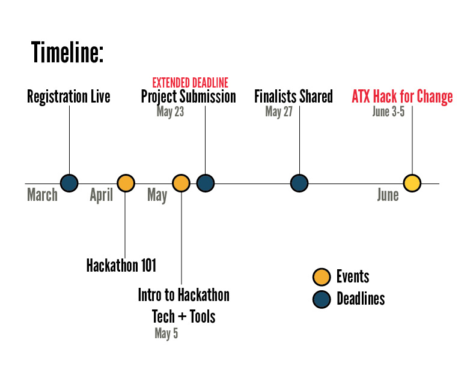

# ATX Hack for Change 2016

## June 3-5 held @ St. Edwards University

#### [:rocket: Register as a Hacker :rocket:](http://atxhackforchange.org/attend.html)
#### [:bulb: Browse and Discuss Projects :bulb:](https://github.com/open-austin/atx-hack-for-change-2016/issues)
#### [:star2: Propose a Project :star2:](https://github.com/open-austin/atx-hack-for-change-2016/issues/new)

### The proposal submission deadline of May 23rd has passed. If you are late to the party, feel free to submit your idea but it will be waitlisted.

## I've submitted my proposal. What comes next?
The project curation committee (which includes representatives from St. Edwards University, Open Austin, and the City of Austin Innovation Office) will follow up with potential project champions and let them know if their project proposal has been accepted.

Finalist projects will be announced by May 27. All registered ATX Hack for Change participants will receive the announced projects and challenges. Additionally, at the Friday, June 3rd kickoff event, the final projects listing will be available in print for those that might have missed it.

## Once your project is accepted, here are some things we suggest you do next!
1. Work on your project pitch. Here is a [slide deck with some helpful resources](https://stedwards.box.com/s/3tedclh520vfo1681j4qx91tfp453lmu) on crafting a 60 second pitch.
2. Create a new Github repo for your project. [need help?](https://help.github.com/articles/create-a-repo/)
3. In your new repo, create a README file explaining the details of your project. Feel free to copy/paste from your project submission. But also try to make it concise. Imagine you are new to the project, what would help you get started? Here are some tips on [what should go on your README](http://atxhack4change.github.io/tech-and-tools/#/3/2).
4. Add Issues to your Github Repo to organize the tasks that your team will need to perform. [Here is some guidance](http://atxhack4change.github.io/tech-and-tools/#/3/4)
5. [Take a survey](http://bit.do/atxhack-style) to discover your creative problem solving style. Learn more about the Basador profile from [these slides](https://stedwards.box.com/s/4wcackr8isebcsb54eecv3a1wcvx4s0v).
6. Log into the ATX Hack for Change [Slack Group](https://atxhack4change.slack.com) and create a channel for your project. If you don't have access, [let us know](mailto:info@open-austin.org).
7. Use the [Civic Tech Planning Canvas](http://www.open-austin.org/civic-tech-canvas/) to flesh out your idea.

