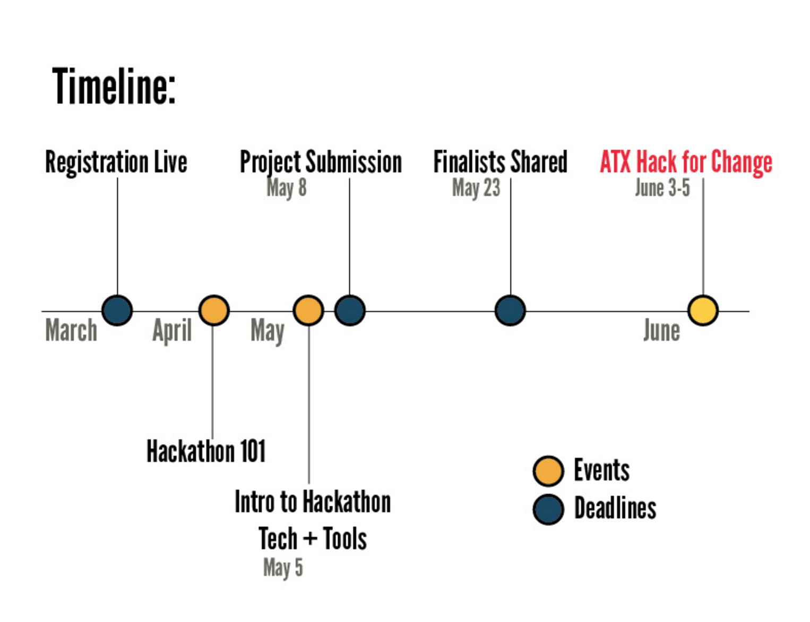

# ATX Hack for Change 2016
## June 3-5th @ St. Edwards University

#### [:rocket: Register :rocket:](http://atxhackforchange.org/attend.html)
#### [:bulb: Browse and Discuss Projects :bulb:](https://github.com/open-austin/atx-hack-for-change-2016/issues)
#### [:star2: Propose a Project :star2:](https://github.com/open-austin/atx-hack-for-change-2016/issues/new)

## How To Propose or Discuss Project Ideas

[GitHub Issues](https://guides.github.com/features/issues/) work just like any other commenting system on the Internet. First, you'll need to [create an account](https://github.com/join). Then you have two options: (1) comment on an existing idea (a.k.a. "issue"), or (2) create a new idea.

If you see an idea that you're interested in, click on it, read the discussion, and then add your thoughts to the bottom of the discussion thread. If you don't see the idea you have in mind, [add a new one](https://github.com/open-austin/atx-hack-for-change-2016/issues/new). Someone from the ATX Hack for Change Organizing Team will respond with some questions or feedback. 

*Here's a [quick video intro](https://www.youtube.com/watch?v=KlrJVSJRUN4) on using Github Issues for discussion.*

## I've added my project idea. What comes next?

### The submission deadline is Sunday, May 8th.

After this date, the project curation committee (which includes representatives from the St. Edwards University, Open Austin, and the City of Austin Innovation Office), will send a second round of questions to potential project champions.

Finalist projects will be announced on May 23rd.

