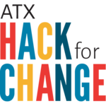

# ATX Hack for Change 2016
## June 3-5, 2016 held @ St. Edwards University

### The ATX Hack for Change 2016 is a wrap! 

To see all the projects that were proposed at the 2016 ATX Hack for Change, [visit the issues list](https://github.com/open-austin/atx-hack-for-change-2016/issues).

Here is a listing of all the projects that were presented:

| Project                                                                                     | Code & Other Links                                                               | 
|---------------------------------------------------------------------------------------------|----------------------------------------------------------------------------------|
| [Permit Application Wizard](https://permit-wiz.herokuapp.com/):classical_building:          | [Github](https://github.com/open-austin/permit-server)                           |
| BRAVE Volunteer Rewards App                                                                 | [Github](https://github.com/jamesjackson/braveapp)                               |
| Texas Veteran Education Benefits                                                            | [Invision Mockup](https://projects.invisionapp.com/share/7G7JFMMCS#/screens/164299780) |
| Internet of Bees                                                                            | [Github](https://github.com/chrisdhanaraj/internetofbees/)                       |
| [ATX Green Atlas](http://jemrrs.github.io/atxgreenatlas/)                                   | [Github](http://github.com/jemrrs/atxgreenatlas)                                 |
| Hack-a-Frac Virtual Reality Game                                                            | [Demo Video](https://dl.dropboxusercontent.com/u/2382871/SLICING%20FOOD%20ACTION%20FLICK%202016.mov) |
| Rideshare ATX Co-op                                                                         | [Github](https://github.com/rideshareatx) & [Slides](http://rideshareatx-org.herokuapp.com/mobility.html#/) |
| Keep Austin Moving ATX                                                                      | [Slides](http://rideshareatx-org.herokuapp.com/#/)                               |
| Xeritopia                                                                                   | [Github](https://github.com/mapineda/xeriscape_atxhacks4change_2016) & [Hackpad](https://hackpad.com/Xeriscape_ATX-OAvRDE8RYyP) |
| BlueChasm Smart Sprinkler System                                                            | [Github](https://github.com/jrriosBC/smart-sprinkler)                            |
| [Community Open Data Portal aka PANDA](http://amaliebarras.github.io/data-portal-new/)      | [Github](https://github.com/amaliebarras/data-portal-new)                        |
| [Expunge Texas](http://expungetexas.org/index.html)                                         | [Github](https://github.com/kkarsnia/expunge)                                    |
| [The Titans Project: Teens in Tech](http://www.thetitansproject.com)                        |                                                                                  |
| Safety Mapping                                                                              | [GH Frontend](https://github.com/Sahedeva/bikePed2) & [GH Backend](https://github.com/Sahedeva/bikePedBackEnd) |
| [Welcome Basket](http://ludwigmace.github.io/atxbasket/#/)                                  | [Github](https://github.com/ludwigmace/atxbasket)                                |
| [Food Hero](http://food-donate.herokuapp.com/)                                              | [Github](https://github.com/rubygeek/food_donate)                                |
| [Rolling With Advantage](http://www.rollingwithadvantage.com)                               | [Github](https://github.com/RollingWithAdvantage) & [Twitter](http://www.twitter.com/RollingWAdvantage) & [Facebook](http://www.facebook.com/rollingwithadvantage/) |
| Find My Open Park :classical_building:                                                      | [Github](https://github.com/wrays/find-my-open-park) & [Google Slides](https://docs.google.com/presentation/d/1gH-l33GbELcQlqxIToG8zglRXoZsZBub2sqdzSUMAuE/edit#slide=id.p) |
| [Open Gov Partnership -> Crossfit for Democracy](http://cityofaustin.github.io/open-gov-partnership/) :classical_building: | [Github](https://github.com/cityofaustin/open-gov-partnership/tree/gh-pages) |
| Auction Bot - Facebook Messenger Bot for Charity Fundraising                                | [GH Frontend](https://github.com/krismuniz/auctionbot) & [GH Server](https://github.com/aaronbenz/auctionbot-back) & [Google Slides](https://docs.google.com/presentation/d/1YHRu6xhLcEZnGyhftL83kgWcwQYARghZmcPnHWNqDZk/edit#slide=id.g128b1b71f0_0_269) |
| [Disable Athlete Health/Equipment Monitoring System](https://dahmos.org/)                   | [Github](https://github.com/Bokbot/damn-hardware)                                |
| [Austin Budget Simulator](http://www.austintexas.gov/dollarsandsense) :classical_building:  |                                                                                  |
| [Impact Map](http://Impactmap.us) - Giving Decisions Based on Big Data                      | [Github](https://github.com/deirdrewalsh/Big-Data-4-Giving-)                     |
| Billtracker                                                                                 | [Github](https://github.com/bill-tracker)                                        |
| Tiny Hacker House                                                                           |                                                                                  |
| Mapping Austin's Culture :classical_building:                                               | [Google Form Survey](https://docs.google.com/forms/d/1xmzcoGHlqaywWjbFW4DdkNQTUiGVekJ0Su_7ZscAeD4/viewform) |

_:classical_building: Indicates project lead by City of Austin employee_
